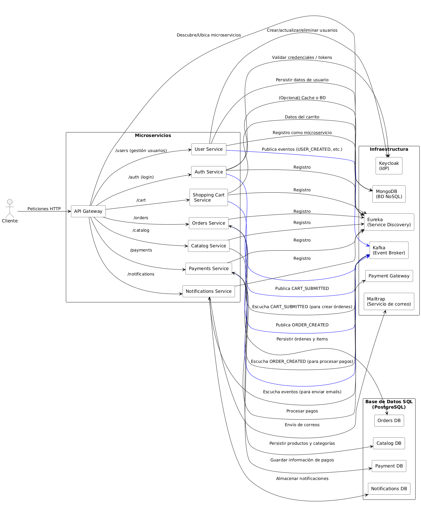
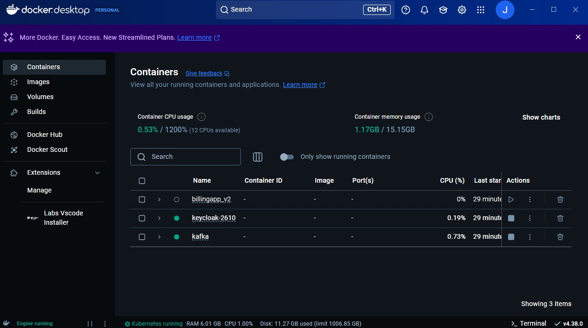
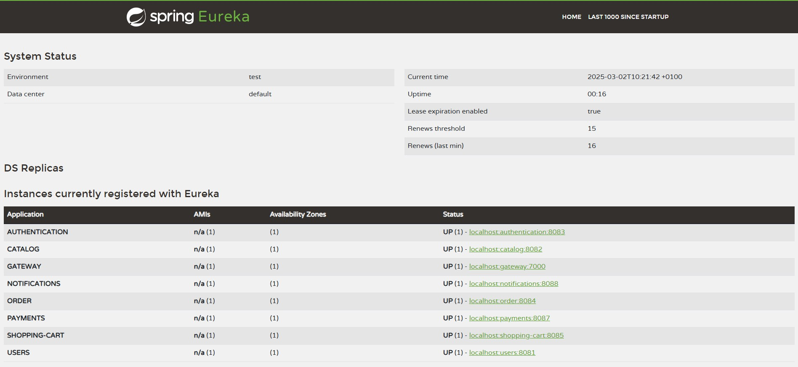
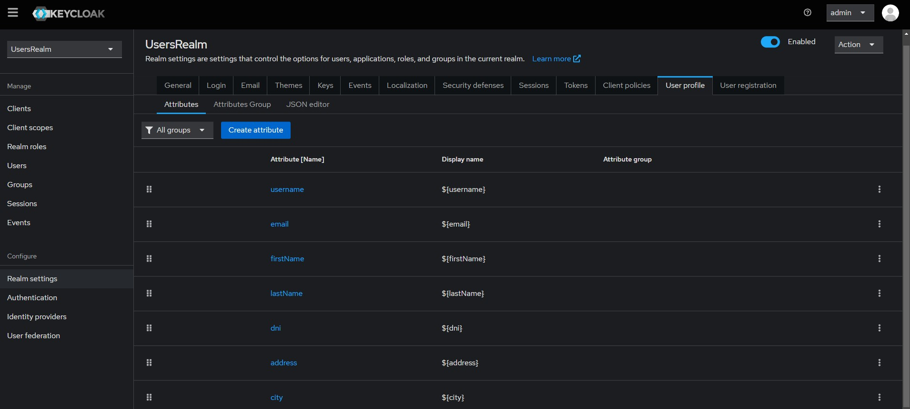
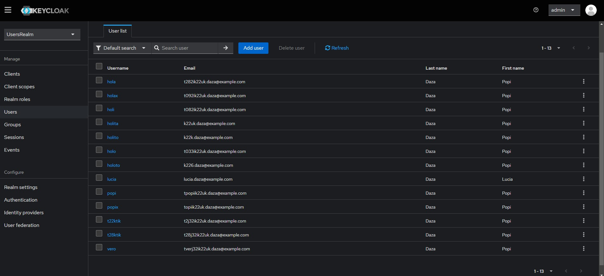
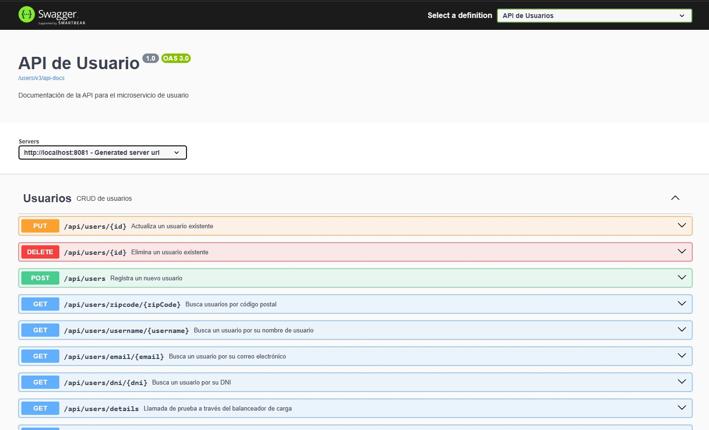

# Microservicios con Spring Boot, Eureka, Keycloak, Kafka y Docker

[](https://www.java.com)
[](https://spring.io/projects/spring-boot)
[](https://www.docker.com)
[](https://kafka.apache.org)
[](https://www.keycloak.org)
[](https://www.postgresql.org)
[](https://www.mongodb.com)

Este repositorio demuestra una **arquitectura de microservicios** utilizando tecnologías modernas, entre ellas:

- **Spring Boot** para la creación de microservicios.
- **Eureka** para el Service Discovery.
- **Kafka** como bus de mensajería.
- **Keycloak** como Proveedor de Identidad (IdP).
- **Docker** para la contenedorización.
- **PostgreSQL** y **MongoDB** para la persistencia de datos.

---

## Tabla de Contenidos

1. [Arquitectura](#arquitectura)
2. [Imágenes de Referencia](#imágenes-de-referencia)
3. [Microservicios y Funcionalidad](#microservicios-y-funcionalidad)
4. [Ejecución en Docker](#ejecución-en-docker)
5. [Configuración de Eureka](#configuración-de-eureka)
6. [Configuración de Keycloak](#configuración-de-keycloak)
7. [Documentación de la API (Swagger)](#documentación-de-la-api-swagger)
8. [Contacto](#contacto)

---

## Arquitectura

El siguiente diagrama muestra la arquitectura general del sistema, integrando microservicios, infraestructuras y bases de datos.



**Descripción:**

- **Cliente:** Realiza peticiones HTTP al **API Gateway**.
- **API Gateway:** Enruta las solicitudes a los distintos microservicios y utiliza **Eureka** para descubrirlos.
- **Eureka:** Registra y descubre los microservicios.
- **Keycloak:** Gestiona la autenticación y autorización.
- **Kafka:** Publica y suscribe eventos (como `USER_CREATED`, `ORDER_CREATED`, `CART_SUBMITTED`, etc.).
- **Bases de Datos:**  
  - **MongoDB**: Almacena datos de usuario y carritos.  
  - **PostgreSQL**: Guarda información relacional para los servicios de *Catalog*, *Orders*, *Payments* y *Notifications*.
- **Servicios Externos:**  
  - **Payment Gateway** para procesar pagos.  
  - **Mailtrap** para el envío de correos.

---

## Imágenes de Referencia

### Docker

  
*Contenedores Docker en ejecución (Keycloak, Kafka, etc.).*

### Eureka

  
*Panel de Eureka mostrando los microservicios registrados.*

### Keycloak

  
  
*Keycloak gestiona los usuarios, roles y atributos, integrándose con el User Service.*

### Swagger

  
*Documentación de la API de Usuario generada con Swagger.*

---

## Microservicios y Funcionalidad

### User Service
- **Funcionalidad:**  
  - Gestión de usuarios (creación, actualización, eliminación).  
  - Persistencia en **MongoDB**.
  - Sincronización con **Keycloak**.
  - Publicación de eventos en **Kafka** (`USER_CREATED`, `USER_UPDATED`, `USER_DELETED`).

### Auth Service
- **Funcionalidad:**  
  - Autenticación de usuarios contra **Keycloak**.
  - Emisión de tokens de acceso (JWT / OIDC).

### Catalog Service
- **Funcionalidad:**  
  - Administración de productos y categorías.
  - Persistencia en **PostgreSQL** (_Catalog DB_).

### Shopping Cart Service
- **Funcionalidad:**  
  - Gestión de carritos de compra.
  - Persistencia en **MongoDB**.
  - Publicación de evento `CART_SUBMITTED` en **Kafka**.

### Orders Service
- **Funcionalidad:**  
  - Creación y gestión de órdenes a partir de eventos de carrito.
  - Persistencia en **PostgreSQL** (_Orders DB_).
  - Publicación de evento `ORDER_CREATED` para que otros servicios reaccionen.

### Payments Service
- **Funcionalidad:**  
  - Procesamiento de pagos basado en eventos `ORDER_CREATED`.
  - Interacción con una **Payment Gateway** externa.
  - Persistencia en **PostgreSQL** (_Payment DB_).

### Notifications Service
- **Funcionalidad:**  
  - Envío de notificaciones vía correo electrónico utilizando **Mailtrap**.
  - Persistencia en **PostgreSQL** (_Notifications DB_).

### API Gateway
- **Funcionalidad:**  
  - Punto de entrada para todas las peticiones de clientes.
  - Enrutamiento de solicitudes a los microservicios correspondientes.
  - Integración con **Eureka** para la localización dinámica de servicios.

---

## Ejecución en Docker

1. **Clonar el repositorio:**
   ```bash
   git clone [https://github.com/tu-usuario/tu-repositorio.git](https://github.com/javicia/microservicios_ecommmerce.git)
